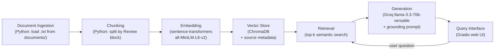

# Project 1 Planning: The Unofficial Guide

> Write this document before you write any pipeline code.
> Your spec and architecture diagram are what you'll use to direct AI tools (Claude, Copilot, etc.) to generate your implementation — the more specific they are, the more useful the generated code will be.
> Update the Retrieval Approach and Chunking Strategy sections if you change your approach during implementation.
> Update this file before starting any stretch features.

---

## Domain

Student reviews of Computer Science professors at Hunter College (CUNY), collected from Rate My Professors. This information is valuable because students often want to know what a professor’s class is actually like, including workload, teaching style, grading, exams, and how much self-study is needed. It is hard to find otherwise because official course listings only describe the class content, not the real student experience across different professors.

---

## Documents

| # | Source | Description | URL or location |
|---|--------|-------------|-----------------|
| 1 | Rate My Professors | Raj Korpan | https://www.ratemyprofessors.com/professor/2659561 |
| 2 | Rate My Professors | Tong Yi | https://www.ratemyprofessors.com/professor/2634841 |
| 3 | Rate My Professors | Pavel Shostak | https://www.ratemyprofessors.com/professor/1823870 |
| 4 | Rate My Professors | Tiziana Ligorio | https://www.ratemyprofessors.com/professor/815879 |
| 5 | Rate My Professors | Katherine St. John | https://www.ratemyprofessors.com/professor/2324096 |
| 6 | Rate My Professors | Subash Shankar | https://www.ratemyprofessors.com/professor/257190 |
| 7 | Rate My Professors | Ioannis Stamos | https://www.ratemyprofessors.com/professor/64427 |
| 8 | Rate My Professors | Eric Schweitzer | https://www.ratemyprofessors.com/professor/257192 |
| 9 | Rate My Professors | Melissa Lynch | https://www.ratemyprofessors.com/professor/2505090 |
| 10 | Rate My Professors | Oyewole Oyekoya | https://www.ratemyprofessors.com/professor/2558461 |

---

## Chunking Strategy

**Chunk size:** One complete review per chunk (~250–500 characters of review text, plus structured metadata: professor name, course/class, quality/difficulty scores, and date). Not a fixed character split — each chunk is one `Review N` block from the source files.

**Overlap:** 0 characters. Each review is a self-contained opinion; overlap would duplicate the same professor/course context across chunks without improving retrieval.

**Reasoning:** My corpus is review-heavy, not long guides. Skimming the documents showed that most reviews are 1–5 sentences (~311 characters on average across ~789 reviews). A fixed 500-character split would merge unrelated reviews or cut a grading-policy sentence in half. Chunking by review boundary keeps each embedding focused on one student's take on one course. Metadata (professor + class) is prepended to each chunk so retrieval can match queries like "Tong Yi CS135" even when the review body doesn't repeat the name. I expect ~750–800 chunks total across 10 documents, which fits the assignment's 50–2,000 chunk target.

**Preprocessing before chunking:** Strip `Likes:` / `Dislikes:` lines and normalize whitespace. Keep professor, class, quality, difficulty, date, and review text.

---

## Retrieval Approach

**Embedding model:** `all-MiniLM-L6-v2` via `sentence-transformers` (runs locally, no API key).

**Top-k:** 5 chunks per query. Enough context for the LLM to synthesize patterns across multiple reviews without flooding the prompt with loosely related professors.

**Production tradeoff reflection:** If cost were not a constraint, I would weigh: (1) **accuracy on short informal text** — general models like MiniLM handle reviews okay, but a model fine-tuned on Q&A or reviews might better match student phrasing; (2) **multilingual support** — some reviews mention accent/clarity and ESL students; a multilingual embedder (e.g., `multilingual-e5-large`) could help if the corpus mixed languages; (3) **context length** — less critical here since my chunks are short; (4) **latency vs. quality** — API-hosted models (OpenAI `text-embedding-3-large`, Cohere) may score higher on domain retrieval but add cost and network dependency; (5) **local vs. hosted** — MiniLM is fine for a class project demo, but production would need monitoring for drift and re-embedding when new reviews are added.

---

## Evaluation Plan

| # | Question | Expected answer |
|---|----------|-----------------|
| 1 | What grading policy do students mention for Tong Yi's CS135 class? | Multiple reviews mention a "fail the final, fail the class" policy — even if homework, projects, and other work are done, failing the final means failing the course. |
| 2 | How is Eric Schweitzer's grade broken down according to student reviews? | Reviews consistently say pop quizzes are worth 60% of the grade (often 15 quizzes with the lowest 5 dropped) and the final is worth 40%. |
| 3 | What do students say about going to Pavel Shostak's office hours? | Reviews say office hours are helpful and accessible — students recommend going for help, and that he will help you significantly if you attend. |
| 4 | Which Hunter CS professor do reviews describe as having a generous exam curve? | Ioannis Stamos — multiple reviews mention generous curves on exams (e.g., +20% on average for CS335) and that he is one of the more lenient/chill graders in the department. |
| 5 | What complaints do students have about Raj Korpan's CSCI499 senior project course? | Reviews mention he does not let students pick groups, assigns individual work, and grades presentations harshly — including losing many points if the presentation is not within a strict time limit (even if early). |

---

## Anticipated Challenges

<!-- What could go wrong? Name at least two specific risks with reasoning.
     Consider: noisy or inconsistent documents, missing source attribution, off-topic
     retrieval, chunks that split key information across boundaries. -->

1. **Conflicting reviews for the same professor.** Tong Yi, Shostak, and others have both positive and negative reviews. Retrieval may return chunks that disagree, and the LLM could over-generalize or pick one side. Mitigation: prompt the model to summarize what reviews say rather than state a single fact; cite multiple sources.

2. **Off-topic or joke reviews.** Some reviews are memes or rants with little factual content (e.g., "she helped my grandma cross the street"). Semantic search may still retrieve them if they share vague words with a query. Mitigation: include professor + class metadata in each chunk; optionally filter chunks below a similarity threshold.

3. **Professor/course name mismatch.** Students refer to courses inconsistently (CS135 vs CSCI13500 vs CSCI135). A query using one format may miss reviews tagged with another. Mitigation: prepend normalized professor and class fields to every chunk at ingestion time.

---

## Architecture

**Stage summary:**

| Stage | Tool / library |
|-------|----------------|
| Document Ingestion | Python — read files from `documents/`, strip boilerplate |
| Chunking | Python — one review per chunk with metadata prefix |
| Embedding | `sentence-transformers` — `all-MiniLM-L6-v2` |
| Vector Store | ChromaDB — persist embeddings + professor/source metadata |
| Retrieval | ChromaDB similarity search — top-k = 5 |
| Generation | Groq API — `llama-3.3-70b-versatile`, context-only prompt |
| Interface | Gradio — question in, answer + sources out |

---

## AI Tool Plan

**Milestone 3 — Ingestion and chunking:**

- **Tool:** Cursor (Claude)
- **Input:** Documents table, Chunking Strategy section, Architecture diagram, and sample content from `documents/rmp_tong_yi.txt`
- **Expected output:** A Python script (e.g., `ingest.py`) that loads all `.txt` files from `documents/`, cleans them, splits into one-review-per-chunk with metadata, and prints 5 sample chunks + total chunk count
- **Verification:** Run the script; confirm each printed chunk is a complete review with professor name; confirm total chunks is between 50 and 2,000 (~750–800 expected); confirm no empty or HTML-artifact chunks

**Milestone 4 — Embedding and retrieval:**

- **Tool:** Cursor (Claude)
- **Input:** Retrieval Approach section, Architecture diagram, and the chunk format produced by Milestone 3
- **Expected output:** A script (e.g., `embed.py` / `retrieve.py`) that embeds chunks with `all-MiniLM-L6-v2`, stores them in ChromaDB with metadata (`source_file`, `professor`, `class`, `chunk_index`), and exposes a `retrieve(query, k=5)` function
- **Verification:** Run retrieval on evaluation questions 1, 2, and 4; print returned chunks and distance scores; confirm top results mention the right professor/topic and distances are below ~0.5 on good matches

**Milestone 5 — Generation and interface:**

- **Tool:** Cursor (Claude)
- **Input:** Grounding requirements from the assignment, Evaluation Plan questions, Architecture diagram, and Gradio skeleton from the README instructions
- **Expected output:** An `ask(question)` function that retrieves chunks, calls Groq with a strict context-only system prompt, returns answer + source list; plus `app.py` Gradio UI wiring it together
- **Verification:** Test 2–3 in-scope eval questions — answers cite source files and match retrieved text; test one out-of-scope question (e.g., Hunter dining halls) — system refuses rather than hallucinating
